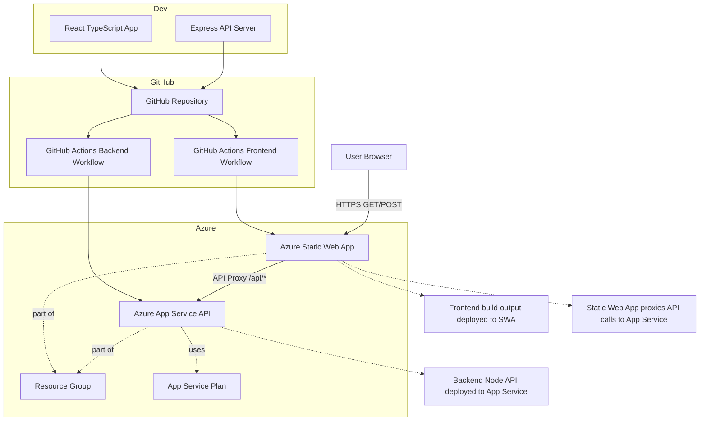

# System Architecture


# Task Manager (React + Express)

## Architecture
- Frontend: React (in `frontend`)
- Backend API: Express (in `backend`)

This repository is prepared for Azure Option 1 deployment:
- Azure Static Web Apps hosts the frontend
- Azure App Service hosts the backend API
- Static Web Apps links to the App Service backend through `/api/*`

## Local Development

### Backend
```bash
npm --prefix backend install
npm --prefix backend run dev
```

### Frontend
```bash
npm --prefix frontend install
npm --prefix frontend start
```

The frontend now uses relative API routes (`/api/tasks`) so it works both:
- Locally via CRA proxy
- In Azure Static Web Apps when backend is linked

## Azure Deployment (Option 1)

Deployment plan details are in `.azure/plan.md`.

### Prerequisites
- Azure subscription: `746887ba-7b8a-4ef3-bc07-9f06372b0806`
- Resource group: `rg-test-taskmanager`
- Region: `swedencentral`
- Naming prefix: `milton-taskmgr`

### GitHub Actions Workflows
- Frontend SWA deploy: `.github/workflows/deploy-static-web-app.yml`
- Backend App Service deploy: `.github/workflows/deploy-api-appservice.yml`

### Required GitHub Secrets and Variables

1. `AZURE_STATIC_WEB_APPS_API_TOKEN`
- Token from your Static Web App deployment settings

2. `AZURE_WEBAPP_PUBLISH_PROFILE`
- Publish profile from your App Service (API)

3. Repository variable `AZURE_WEBAPP_NAME`
- Set to your API web app name (for example `milton-taskmgr-api`)

### Azure Resource Provisioning (recommended names)
- Static Web App: `milton-taskmgr-swa`
- App Service Plan: `milton-taskmgr-plan`
- Web App API: `milton-taskmgr-api`

### Link Static Web App to App Service Backend
After both resources exist and first deployments complete, link backend in Azure Portal:
1. Open your Static Web App
2. Go to **Backends**
3. Link your App Service API

Once linked, requests to `/api/*` from the frontend route to your App Service API.
